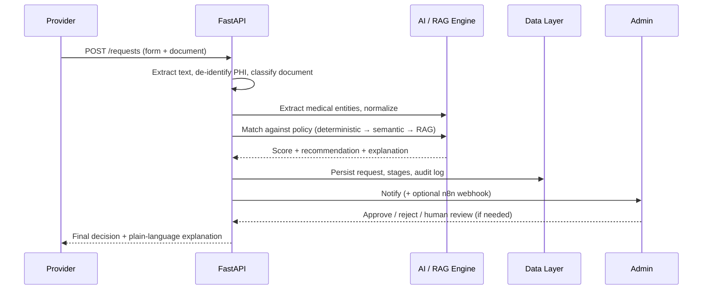

<div align="center">

# 🩺 Zintellect AI
### An explainable AI copilot for insurance prior authorization

*Turning weeks of policy paperwork into a decision made in seconds — one you can actually trust.*


</div>

---

## 💡 Why we built this

If you've ever waited on a doctor's office to "get insurance approval" before you could get an MRI, a specialty medication, or a procedure — you've felt prior authorization. It's one of the most universally hated parts of the healthcare system: physicians spend dozens of hours a week filling out forms and re-explaining medical necessity, and patients wait, sometimes dangerously long, for a payer to say yes.

**Zintellect AI** is our answer: a system that reads the clinical evidence, reads the policy, and tells you — in plain language, with citations — whether the request meets the bar. Confident cases clear instantly. Everything else goes to a human, with a full paper trail either way.

> No black boxes. No "denied, reason unknown." Every decision comes with a *why*.

---

## ✨ What it actually does

| | |
|---|---|
| 📄 **Reads anything** | Upload a PDF or scanned image — OCR and text extraction handle the rest. |
| 🔒 **Protects patients** | Clinical text is de-identified (PHI stripped) before it ever touches the AI layer. |
| 🧠 **Understands clinically** | A local LLM (via Ollama) extracts and normalizes medical entities from free text. |
| ⚖️ **Matches policy, not vibes** | A hybrid engine — deterministic keyword checks *plus* semantic similarity — scores every request against the actual policy text. |
| 🔍 **Explains itself** | A hierarchical RAG pipeline grounds every explanation in the real policy clause; an XAI service writes the contrastive rationale — for both clinicians and patients. |
| 🧑‍⚖️ **Keeps a human in the loop** | Mid-confidence cases are routed to a reviewer, who can override the AI — and that override is logged too. |
| 🧾 **Never forgets a step** | Every stage (extraction → classification → matching → explanation) is persisted, so any decision can be traced and audited later. |
| 🔗 **Plugs into your stack** | n8n webhooks let you fan decisions out to EHRs, billing systems, or anywhere else you need them. |

---

## 🏗️ How it's built

```
┌──────────────────────┐        REST + JWT        ┌───────────────────────────┐
│       Frontend        │ ───────────────────────▶ │        Backend API        │
│  React 19 + Vite       │                          │  FastAPI + SQLAlchemy     │
│  Tailwind CSS v4       │ ◀─────────────────────── │  JWT auth · APScheduler   │
│  Admin/Provider/Member │                          │  Routes → Services layer  │
└──────────────────────┘                           └─────────────┬─────────────┘
                                                                    │
                                          ┌─────────────────────────┼───────────────────────────┐
                                          ▼                         ▼                           ▼
                                ┌───────────────────┐   ┌───────────────────────┐   ┌────────────────────┐
                                │     Data Layer     │   │      AI / RAG Engine   │   │        n8n          │
                                │ SQLite (relational) │   │ Ollama LLM (LangChain) │   │ Workflow automation │
                                │ ChromaDB (vectors)  │   │ Sentence-Transformers  │   │ EHR · billing hooks │
                                └───────────────────┘   │ Hierarchical RAG       │   └────────────────────┘
                                                          │ XAI explanation service│
                                                          └───────────────────────┘
```

### Tech stack

| Layer | Technology | Purpose |
|---|---|---|
| **Frontend** | React 19 + Vite, Tailwind CSS v4, React Router v7, Lucide icons | SPA for admins, providers, and patients — dark mode, real-time polling, file uploads |
| **Backend** | FastAPI (Python 3.10+), SQLAlchemy ORM, SQLite (dev), bcrypt/JWT | REST API, background jobs (APScheduler), auth, admin panel |
| **AI / ML** | Ollama (`qwen2.5:1.5b-instruct`), LangChain, Sentence-Transformers, ChromaDB, custom RAG + XAI | Entity extraction, policy matching, similarity scoring, explainable reasoning |
| **Infrastructure** | Docker (optional), nginx, n8n | Containerization, reverse proxy, event-driven external workflows |
| **Tooling** | Pytest, Ruff, Prettier, manual migrations | Testing, linting, DB versioning, demo data |

---

## 🧠 The decision engine, step by step

Clinical text doesn't go straight to an LLM and hope for the best. It climbs an escalating ladder of scrutiny, and only goes as far as it needs to:

1. **Deterministic check** — exact keyword/phrase matching against policy requirements. Fast, high-precision, and instantly explainable when it works.
2. **Semantic matching** — if the deterministic pass isn't confident enough, Sentence-Transformer embeddings + ChromaDB cosine similarity catch paraphrased or less obvious matches.
3. **Hierarchical RAG** — pulls wider context around the matched chunks so the eventual explanation is grounded in the *actual* source policy, not a guess.
4. **XAI reasoning** — generates a contrastive explanation: why a condition *was* or *wasn't* met, citing specific clauses and supporting clinical evidence.

The final score blends deterministic and semantic signals (default weighting: 60% / 40%, tunable in `policy_matcher`), and routes automatically:

| Score | Outcome |
|---|---|
| **≥ 90** | ✅ Auto-approve (where policy permits) |
| **31 – 89** | 🟡 Flagged for human review |
| **≤ 30** | ❌ Auto-deny |

Every one of these steps writes an `AuthorizationStage` row and an `AuditLog` entry — so any decision, automated or human, can be reconstructed and defended later.

---

## 🔄 A request's life, end to end



---

## 📁 Project structure

```
backend/
├─ app/
│  ├─ main.py                 # Entrypoint: DB init, seeding, routers, CORS, scheduler
│  ├─ database/db.py          # SQLAlchemy engine, session factory
│  ├─ models/                 # SQLAlchemy models (User, PriorAuthRequest, AuditLog, ...)
│  ├─ routes/                 # FastAPI routers (requests, policies, admin, review, ...)
│  └─ services/                # Business logic (ai_service, policy_matcher, xai, ...)
├─ tests/                     # Pytest suite
└─ docs/                      # API deep-dives, service contracts, data dictionary

frontend/
├─ src/
│  ├─ components/             # Reusable UI (buttons, modals, tables, uploads)
│  ├─ layouts/                # AdminLayout, ProviderLayout, ...
│  ├─ pages/                  # Route-matched views
│  ├─ hooks/                  # useAuth, useApi, usePolling
│  ├─ services/                # Axios instance with JWT interceptor
│  └─ utils/                  # Formatters, validation, date helpers

n8n/                          # Exported workflow JSON for external automation
docker-compose.yml            # One-click stack (backend + frontend + nginx)
```

---

## 🚀 Getting it running locally

### Prerequisites
- Python ≥ 3.10
- Node.js ≥ 18
- [Ollama](https://ollama.com/download) installed and running (`ollama serve`)

### 1 · Backend

```bash
cd backend
python -m venv venv

# Windows
.\venv\Scripts\Activate.ps1
# macOS / Linux
source venv/bin/activate

pip install -r requirements.txt
cp .env.example .env      # set SECRET_KEY at minimum

uvicorn app.main:app --host 0.0.0.0 --port 8000 --reload
```
- Swagger UI → `http://localhost:8000/docs`
- A default admin (`admin@gmail.com` / `admin123`) is auto-seeded on first run.

### 2 · Pull the AI model

```bash
ollama pull qwen2.5:1.5b-instruct   # or set OLLAMA_MODEL in .env
```

### 3 · Frontend

```bash
cd frontend
npm install
npm run dev     # → http://localhost:5173
```
Set `VITE_API_URL` in `frontend/.env` if your backend isn't on `http://127.0.0.1:8000`.

### 4 · Log in as admin

Visit `http://localhost:5173/admin-login` and use the seeded credentials above (or run `python seed_admin.py --auto` to recreate them).

---

## 🧪 Testing & tooling

```bash
cd backend && pytest              # unit + integration tests
ruff check .                      # Python linting
cd ../frontend && npx eslint .    # JS/JSX linting
```

---

## 🗺️ Roadmap

- [ ] Swap SQLite → Postgres and ship the included Docker Compose stack
- [ ] Tune deterministic/semantic score weighting per payer
- [ ] Richer admin analytics (SLA breach trends, approval-rate dashboards)
- [ ] Direct EHR integration via the existing n8n webhook layer
- [ ] Multi-model ensemble for high-cost / high-stakes procedure categories
- [ ] Formal clinical validation loop using real appeal outcomes

---

## 🙌 Why it matters

According to the AMA's 2024 Prior Authorization Physician Survey of 1,000 practicing physicians, the vast majority say the process delays necessary care and fuels burnout, and practices spend real, measurable hours every week just processing requests. Most of that isn't because the cases are hard — it's because the process is slow, opaque, and manual. Zintellect doesn't try to replace clinical judgment. It tries to make the *obvious* calls instant and explainable, so that the time and attention of human reviewers goes where it's actually needed: the genuinely hard cases.

---

<div align="center">

Built for the hackathon with ❤️, open-source AI, and a strong opinion that healthcare software should explain itself.

**Explore further:** `app/services/policy_matcher.py` · `app/services/ai_service.py` · `app/routes/request_routes.py` · `frontend/src/pages/`

</div>
