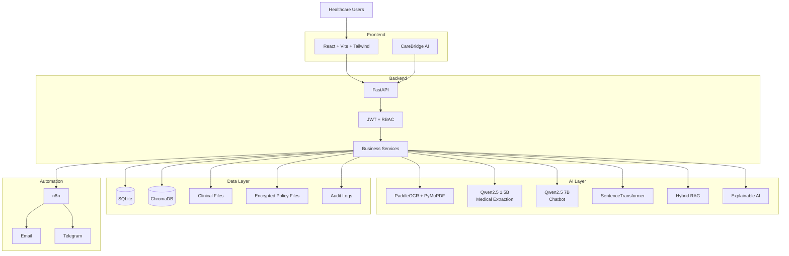
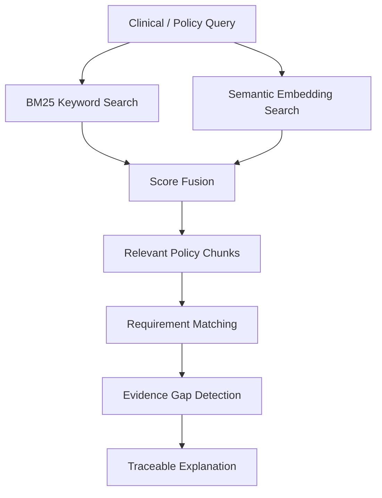

# Zintellect AI

## AI-Powered Prior Authorization Automation Platform

> An AI-assisted healthcare prior authorization platform that combines
> clinical document intelligence, local LLMs, insurance policy matching,
> RAG, explainable AI, workflow automation, and human-in-the-loop
> review.

**Status:** Research Prototype / Active Development

------------------------------------------------------------------------

## 📌 Overview

Prior authorization requires healthcare providers to collect clinical
evidence, interpret payer-specific requirements, submit documentation,
and track requests through multiple stages.

**Zintellect AI** brings these activities into a unified workflow. It
processes clinical documents, extracts relevant medical information,
retrieves applicable insurance policy requirements, identifies missing
evidence, and generates an advisory recommendation with supporting
reasoning.

The system is designed as **decision support, not autonomous
authorization**. AI recommendations are reviewed by a human provider
before a final authorization decision.

------------------------------------------------------------------------

## ❗ Problem Statement

Healthcare providers involved in prior authorization often need to:

1.  Collect clinical records from multiple sources.
2.  Extract diagnoses, symptoms, medications, procedures, and treatment
    history.
3.  Understand payer-specific policy requirements.
4.  Check whether submitted evidence satisfies those requirements.
5.  Identify missing or incomplete documentation.
6.  Prepare and submit authorization requests.
7.  Track request status and deadlines.
8.  Handle additional-information requests.

### Core Challenges

  -----------------------------------------------------------------------
  Challenge                           Impact
  ----------------------------------- -----------------------------------
  Manual document review              Increased administrative workload

  Unstructured clinical information   Difficult information extraction

  Payer-specific policies             Complex requirement matching

  Missing evidence                    Delays and resubmissions

  Limited traceability                Difficult to understand
                                      evidence-to-policy relationships

  Status tracking                     Reduced workflow visibility
  -----------------------------------------------------------------------

------------------------------------------------------------------------

## 💡 Proposed Solution

Zintellect AI creates an intelligent pipeline:

**Clinical Documents → Text/OCR → Medical Entity Extraction → Policy
Retrieval → Evidence Matching → Explainable Recommendation → Human
Review → Final Decision → Notification**

### Solution Highlights

-   Clinical document upload and processing
-   OCR and text extraction
-   Medical entity extraction using Qwen2.5
-   Insurance policy processing and matching
-   Hybrid BM25 + semantic retrieval
-   Missing evidence detection
-   Explainable AI reasoning
-   Human-in-the-loop review
-   Document quality and similarity analysis
-   Authorization readiness scoring
-   Contradiction detection
-   CareBridge AI chatbot
-   n8n workflow automation
-   Email and Telegram notifications
-   Audit logging and SLA monitoring

------------------------------------------------------------------------

## 🎯 Objectives

-   Automate repetitive clinical information extraction.
-   Reduce manual document-processing effort.
-   Match clinical evidence with insurance policy requirements.
-   Detect missing documentation before submission.
-   Provide transparent AI-assisted recommendations.
-   Preserve human authority over final decisions.
-   Improve request tracking and SLA visibility.
-   Provide a policy-aware conversational assistant.
-   Maintain an auditable authorization workflow.

------------------------------------------------------------------------

## ✨ Key Features

### 👤 Authentication & Roles

-   JWT authentication
-   Role-based access control
-   Admin, Doctor, Patient, and Provider roles
-   bcrypt password hashing
-   Password reset
-   Role-specific dashboards

### 📄 Prior Authorization

-   Request creation
-   Multi-file clinical document upload
-   Insurance verification
-   Document classification
-   Processing-stage tracking
-   AI recommendation
-   Human review queue
-   Approve / Reject / Request Information workflow
-   Urgency classification
-   SLA tracking

### 🧠 Medical Document Intelligence

-   PDF text extraction
-   Scanned PDF OCR
-   DOCX extraction
-   Image OCR
-   Medical entity extraction
-   Structured JSON output
-   Pydantic validation
-   Source-grounding verification
-   PHI de-identification
-   Regex fallback extraction
-   Text caching

### 🏥 Insurance Policy Intelligence

-   Policy PDF upload
-   Policy text extraction
-   Required-document extraction
-   Required-condition extraction
-   Policy matching
-   Policy versioning
-   Duplicate policy detection
-   Policy clause retrieval
-   Admin policy approval

### 🔎 Retrieval & RAG

-   BM25 keyword retrieval
-   SentenceTransformer embeddings
-   ChromaDB vector search
-   Hybrid retrieval
-   Hierarchical policy chunking
-   Semantic similarity
-   SQLite fallback
-   Evidence-to-policy traceability

### 📊 Explainable AI

-   Matched policy requirements
-   Missing-document detection
-   Confidence scoring
-   Policy clause references
-   Medical evidence summaries
-   Provider explanations
-   Patient-friendly explanations
-   Authorization readiness score

### 🔍 Additional AI Features

-   Cross-document contradiction detection
-   Document quality checking
-   Duplicate request detection
-   Request prioritization
-   Appeal assistance
-   Policy version comparison

------------------------------------------------------------------------

## 🏗️ System Architecture



------------------------------------------------------------------------

## 🔄 End-to-End Workflow

``` mermaid
flowchart LR
    A[Create PA Request] --> B[Upload Documents]
    B --> C[File Validation]
    C --> D[OCR / Text Extraction]
    D --> E[Document Classification]
    E --> F[PHI Masking]
    F --> G[Qwen2.5 Extraction]
    G --> H[Schema Validation]
    H --> I[Source Grounding]
    I --> J[Retrieve Policy]
    J --> K[Hybrid Policy Matching]
    K --> L[Evidence Gap Detection]
    L --> M[Confidence / Readiness]
    M --> N[XAI Recommendation]
    N --> O[Human Review]
    O --> P{Final Decision}
    P -->|Approve| Q[Approved]
    P -->|Reject| R[Rejected]
    P -->|Request Info| S[Pending Additional Information]
    Q --> T[Notification + Audit]
    R --> T
    S --> T
```



------------------------------------------------------------------------

## 🤖 AI & LLM Stack

  -----------------------------------------------------------------------
  Model / Technology                  Purpose
  ----------------------------------- -----------------------------------
  **Qwen2.5 1.5B Instruct**           Medical entity extraction

  **Qwen2.5 7B Instruct**             CareBridge AI chatbot

  **Ollama**                          Local LLM inference

  **PaddleOCR**                       OCR for scanned documents/images

  **PyMuPDF**                         PDF text extraction

  **SentenceTransformer --            384-dimensional embeddings
  all-MiniLM-L6-v2**                  

  **BM25**                            Keyword retrieval

  **ChromaDB**                        Vector retrieval

  **Google Gemini (optional)**        Natural-language explanations
  -----------------------------------------------------------------------

### Model Separation

``` text
OLLAMA_MODEL  = qwen2.5:1.5b-instruct
CHATBOT_MODEL = qwen2.5:7b-instruct
```

The smaller model is used for structured medical extraction, while the
larger model powers the conversational assistant.

------------------------------------------------------------------------

## 🔎 RAG & Policy Matching

Zintellect uses a hybrid retrieval strategy:



This combines exact terminology matching with semantic similarity to
retrieve relevant policy sections.

------------------------------------------------------------------------

## 👨‍⚕️ Human-in-the-Loop

A central design principle is:

> **AI assists; humans decide.**

The AI generates an advisory recommendation based on document
completeness, evidence satisfaction, policy matching, and confidence.

Every request enters **Awaiting Review**. A human provider can:

-   Approve
-   Reject
-   Request additional information

The AI recommendation and human decision are stored separately,
providing traceability and auditability.

------------------------------------------------------------------------

## 💬 CareBridge AI

**CareBridge AI** is the conversational assistant embedded in the
Zintellect interface.

It provides:

-   Policy-aware question answering
-   Retrieved policy context
-   Source information
-   Grounded-response indicators
-   Manual-review warnings
-   Prompt-injection protection
-   Secret-leakage prevention
-   Safe fallback behavior
-   No-diagnosis restriction
-   No autonomous authorization decisions

### Chat Flow

``` text
User Question
      ↓
FastAPI /chat
      ↓
Input Validation
      ↓
Policy Retrieval
      ↓
Grounded Prompt
      ↓
Qwen2.5 7B
      ↓
Response Validation
      ↓
Grounding Check
      ↓
Answer + Sources + Warning
```

------------------------------------------------------------------------

## 🔔 Notification & Automation

The backend integrates with **n8n** for event-driven workflow
automation.

Example:

``` text
Prior Authorization Request
          ↓
      AI Processing
          ↓
      Human Review
          ↓
      Final Decision
          ↓
       n8n Event
       ↙       ↘
   Email     Telegram
```

The project also supports SLA monitoring, status notifications, email
workflows, audit events, and backend/error notification workflows.

------------------------------------------------------------------------

## 🛠️ Technology Stack

  Layer            Technologies
  ---------------- -----------------------------------------
  Frontend         React, Vite, Tailwind CSS, React Router
  Backend          FastAPI, Uvicorn
  Database         SQLite, SQLAlchemy
  LLM Runtime      Ollama
  LLMs             Qwen2.5 1.5B, Qwen2.5 7B
  OCR              PaddleOCR, PaddlePaddle
  PDF              PyMuPDF
  DOCX             python-docx
  Embeddings       SentenceTransformer
  Vector DB        ChromaDB
  Retrieval        BM25 + Semantic Similarity
  Validation       Pydantic
  Authentication   JWT + bcrypt
  Automation       n8n
  Notifications    SMTP Email + Telegram
  Monitoring       Sentry (optional)
  Testing          Pytest, Vitest, Playwright

------------------------------------------------------------------------

## 📁 Project Structure

``` text
Zintellect_new_3/
├── backend/
│   ├── app/
│   │   ├── database/
│   │   ├── models/
│   │   ├── routes/
│   │   └── services/
│   │       ├── retrieval/
│   │       ├── embeddings/
│   │       ├── rag/
│   │       ├── xai/
│   │       ├── contradiction_detection/
│   │       ├── evidence_extraction/
│   │       ├── evidence_trace/
│   │       ├── document_quality/
│   │       ├── policy_versioning/
│   │       ├── readiness_score/
│   │       └── appeal_assistant/
│   ├── tests/
│   ├── uploads/
│   ├── vector_db/
│   └── requirements.txt
│
├── frontend/
│   └── frontend/
│       ├── src/
│       │   ├── components/
│       │   ├── pages/
│       │   ├── services/
│       │   └── __tests__/
│       ├── e2e/
│       └── package.json
│
├── n8n/
├── contradiction_detection/
├── evidence_to_policy_trace/
├── test_uploads/
├── zintellect-site/
└── README.md
```

------------------------------------------------------------------------

## 🗄️ Database

The application uses SQLite with SQLAlchemy ORM.

Main entities include:

-   Users
-   Insurance Providers
-   Insurance Members
-   Prior Authorization Requests
-   Insurance Policies
-   Human Reviews
-   Authorization Stages
-   Uploaded Files
-   Notifications
-   Audit Logs
-   Email Logs

------------------------------------------------------------------------

## 🔐 Security & Safety

Implemented safeguards include:

-   JWT authentication
-   Role-based authorization
-   bcrypt password hashing
-   Pydantic input validation
-   File type and size validation
-   PHI de-identification before LLM processing
-   Prompt-injection protection
-   Secret-leakage prevention
-   Fernet policy-file encryption
-   Audit logging
-   Safe error responses
-   Configurable CORS
-   Human review requirement
-   Duplicate-decision protection

The project is intended for synthetic/test data and has not been
clinically validated for production healthcare use.

------------------------------------------------------------------------

## 🧪 Testing

The documented test suite contains:

  Area            Tests
  ----------- ---------
  Backend           304
  Frontend           42
  **Total**     **346**

Testing covers authentication, API validation, chatbot behavior, prompt
injection, data integrity, security, human review, AI evaluation,
regression workflows, and end-to-end scenarios.

### Run backend tests

``` bash
cd backend
python -m pytest tests/ -v
```

### Run frontend tests

``` bash
cd frontend/frontend
npm test
```

### Build frontend

``` bash
cd frontend/frontend
npm run build
```

------------------------------------------------------------------------

## ⚡ Performance

The current prototype uses CPU-based local inference.

  Component                    Typical Latency
  -------------------------- -----------------
  Digital PDF extraction              \< 1 sec
  Image OCR                           1--5 sec
  Scanned PDF OCR                \~25 sec/page
  Medical LLM extraction            10--30 sec
  Semantic policy matching            1--3 sec
  BM25 retrieval                      \< 1 sec
  CareBridge AI                      5--20 sec
  End-to-end processing             30--90 sec

GPU inference, model optimization, batching, and vLLM are potential
future performance improvements.

------------------------------------------------------------------------

## 🚀 Quick Start

### Prerequisites

-   Python 3.11 recommended
-   Node.js 18+
-   npm 9+
-   Ollama
-   Git

### 1. Clone

``` bash
git clone <repository-url>
cd Zintellect_new_3
```

### 2. Start Ollama

``` bash
ollama serve
```

Pull the models:

``` bash
ollama pull qwen2.5:1.5b-instruct
ollama pull qwen2.5:7b-instruct
```

### 3. Backend

``` bash
cd backend
python -m venv venv
```

Windows:

``` bash
venv\Scripts\activate
```

Linux / WSL / macOS:

``` bash
source venv/bin/activate
```

Install dependencies:

``` bash
pip install -r requirements.txt
```

Configure `backend/.env`:

``` env
SECRET_KEY=<your-secret-key>
OLLAMA_MODEL=qwen2.5:1.5b-instruct
CHATBOT_MODEL=qwen2.5:7b-instruct
OLLAMA_HOST=http://localhost:11434
APP_ENV=development
```

Run:

``` bash
uvicorn app.main:app --reload --host 0.0.0.0 --port 8000
```

### 4. Frontend

Open another terminal:

``` bash
cd frontend/frontend
npm install
```

Set:

``` env
VITE_API_URL=http://localhost:8000
```

Run:

``` bash
npm run dev
```

Open the URL shown by Vite, normally:

``` text
http://localhost:5173
```

### API Documentation

``` text
http://localhost:8000/docs
```

------------------------------------------------------------------------

## 📸 Demo / Screenshots

Recommended screenshots for the GitHub repository:

1.  Landing page
2.  Doctor dashboard
3.  Prior authorization request form
4.  Clinical document upload
5.  AI processing tracker
6.  Medical information extraction
7.  Policy matching
8.  Explainability dashboard
9.  Provider review queue
10. CareBridge AI chatbot
11. Telegram notification
12. Admin analytics

Suggested folder:

``` text
docs/
└── screenshots/
    ├── landing-page.png
    ├── dashboard.png
    ├── request-form.png
    ├── document-analysis.png
    ├── policy-matching.png
    ├── explainability.png
    ├── review-queue.png
    ├── chatbot.png
    └── telegram-notification.png
```

------------------------------------------------------------------------

## 🔮 Future Enhancements

### Performance & Infrastructure

-   GPU-accelerated inference
-   vLLM evaluation
-   Model quantization
-   Batch processing
-   WebSocket-based updates
-   Docker deployment
-   PostgreSQL migration

### AI

-   Improved temporal reasoning
-   Advanced contradiction detection
-   Evidence provenance
-   Uncertainty propagation
-   Reviewer-feedback learning
-   Multimodal document understanding

### Healthcare Integration

-   FHIR integration
-   Da Vinci interoperability
-   EHR integration
-   Formal compliance assessment

------------------------------------------------------------------------

## 🔬 Research Relevance

Zintellect AI explores:

-   Healthcare document intelligence
-   AI-assisted prior authorization
-   Policy-aware retrieval
-   Hybrid RAG
-   Explainable AI
-   Reliable local LLM systems
-   Source-grounded extraction
-   Human-centered AI
-   Uncertainty-aware decision support

------------------------------------------------------------------------

## ⚠️ Disclaimer

**Zintellect AI is a research, development, and demonstration
prototype.**

-   It is not a medical device.
-   It does not replace healthcare professionals or insurance reviewers.
-   AI-generated information may be incomplete or inaccurate.
-   It does not make final insurance approval or denial decisions
    autonomously.
-   Human validation is required.
-   It has not been clinically validated for production use.
-   Real patient information should not be used without appropriate
    privacy, security, and compliance safeguards.

------------------------------------------------------------------------

## 📄 License

License: **To be decided by the project owners.**

------------------------------------------------------------------------

## 👥 Project

**Zintellect AI --- AI-Powered Prior Authorization Automation Platform**

> **AI assists. Evidence supports. Humans decide.**
